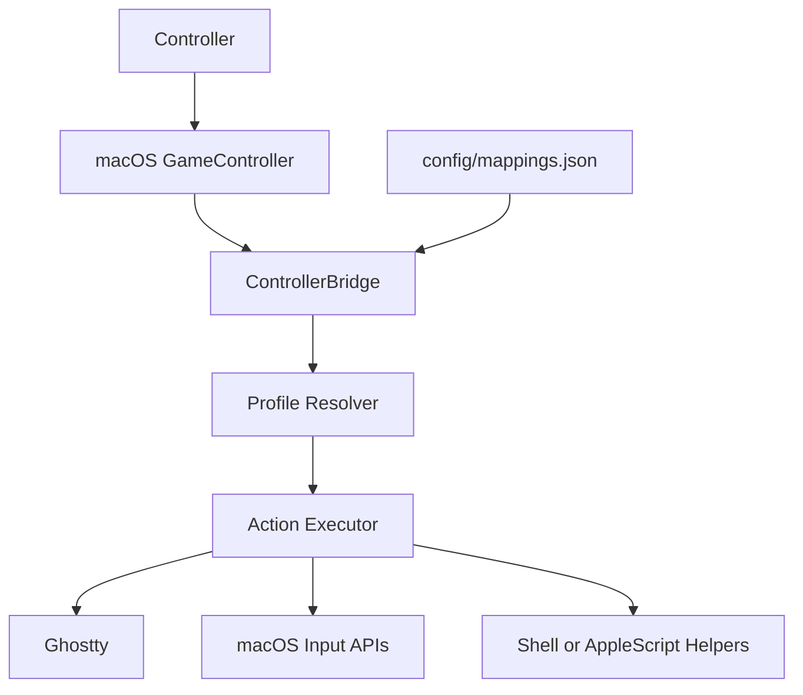

# Stadia macOS Controller Bridge

Turn a Stadia controller into a local macOS control surface for real desktop apps.

This bridge reads controller input through macOS `GameController`, resolves the frontmost app, and dispatches profile-specific actions such as keystrokes, Ghostty native actions, shell helpers, and a few targeted window interactions. The current setup is optimized for Ghostty first, with additional profiles for Codex, Arc, Slack, and WhatsApp.

## What Works Today

- Ghostty tab and split navigation
- Ghostty-focused scrolling
- Global always-on controls such as tab, enter, escape, display movement, and analog scroll
- Codex thread navigation, chat-box focus, and draft clearing
- Arc pointer, scroll, click, refresh, and copy-URL shortcuts
- Slack thread and sidebar navigation

## Why This Exists

The goal is not generic controller automation. The goal is a small, local, explicit bridge that makes a controller useful for a real macOS workflow without hiding behavior behind a giant rules engine.

Key design choices:

- explicit app profiles instead of fallback heuristics
- config-driven mappings in `config/mappings.json`
- native macOS frameworks first
- Ghostty-native actions when Ghostty already has first-class semantics
- local launchd install with one stable app identity for Accessibility trust

## Quick Start

Diagnose what macOS exposes from the controller:

```bash
swift run stadia-controller-bridge --config config/mappings.json --diagnose-controller
```

Run the bridge live from the repo:

```bash
swift run stadia-controller-bridge --config config/mappings.json --no-dry-run
```

Install the stable launchd service:

```bash
./scripts/install-launchd-bridge.sh --repo-dir "$PWD" --mode live
```

That installer also creates a user-launchable menu bar app at:

```text
~/Applications/Stadia Controller Bridge.app
```

If the bridge is down, you can relaunch it from Finder or Spotlight by opening that app.

Verify the live service:

```bash
./scripts/verify-launchd-bridge.sh
```

## Demo-Ready Flow

If you want to record or announce the project publicly, the cleanest path is:

1. Open Ghostty, Codex, and Arc ahead of time.
2. Verify Accessibility trust and the live LaunchAgent.
3. Show Ghostty tab/split control first.
4. Show always-on controls next.
5. Show Codex thread switching and triangle clearing.
6. Show Arc pointer + scroll + click.

Use [docs/references/demo-checklist.md](docs/references/demo-checklist.md) for the exact preflight and recovery steps.

## Architecture



## Repo Guide

- Runtime overview: [docs/architecture/bridge-overview.md](docs/architecture/bridge-overview.md)
- Ghostty integration notes: [docs/architecture/ghostty-integration.md](docs/architecture/ghostty-integration.md)
- Setup and operations: [docs/references/setup.md](docs/references/setup.md)
- Deployment and launchd flow: [docs/references/deployment.md](docs/references/deployment.md)
- Config contract: [docs/references/mappings-schema.md](docs/references/mappings-schema.md)
- Repo validation contract: [docs/references/repo-contract.md](docs/references/repo-contract.md)

## Constraints

- macOS only
- local-first; no cloud dependency
- explicit `appProfiles` matching only
- mappings hot-reload, but runtime/schema changes require reinstalling the staged launchd app
